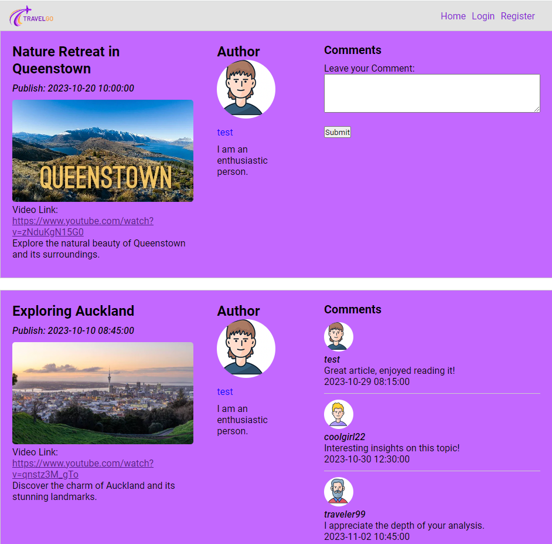

Our webapp "TRAVELGO" is a blog app that allows users to share their experiences travelling around the world, although we have only created posts based in New Zealand. It's a blog that allows users to interact with posts and share their adventuring stories. 

The compulsory features that we have completed:
    
    - Allowed users to create new accounts on the blog which require the standard username and password login details. The only other field parameters involved are the users full name, DOB, avatar selection and a small description about themselves.
    - Username's are unique and can only be created once. A message will notify the user if their entered username has already been selected or not. 
    - User's can only create an account if the password they create matches the "re-enter password" text field. Otherwise, they will not be able to create an account. 
    - We have 6 defined avatar icons for the user to create an account with.
    - User can easily login and logout through the login button on the nav bar. 
    - Passwords are hashed and salted using the bcrypt npm package and are stored securely on the database. 
    - Users can clearly browse through all published blog articles by each unique user. Each user will have access to their own blogs in the home page and can see a list of their published articles in their dashboard. 
    - Users can edit, add and delete new articles at any time. 
    - Users can edit any article whether it be created or not via the use of the TINYMCE WSYIWYG text editor at will. The text editor has a variety of features including, bold text, italic, bullet points, tables, and the ability to add headers. 
    - The user will be able to add an image to support their blog entry via a button as an attachment. *** this video link is for the purpose of the assignment only. We do not want to breach any copyright laws.**  They can also submit a video URL to enhance their blog. 
    - Users can freely edit their published blogs. 
    - website is functional, consistent and responsive!

The extra features that we have implemented had changed from our initial submission to Andrew Meads. Throughout the coding process we had to make decisions to cut certain content due to time constraints. 

The extra features that we included are: 
    - Video link in the blog - *** this video link is for the purpose of the assignment only. We do not want to breach any copyright laws.**
    - Users can add comments to blogs
    - We have a text pop up for a successful registration
    
To run our webapp - Other than NPM install, the marker needs to start up DB SQLite and run the sql file inside the "sql" folder, press "write changes" then they can run npm start in the VSC terminal. They should see the home page after loading localhost:3000.  

They should see this page when it's loaded correctly - 

There are three published blogs that have been hardcoded for the marker to see. The marker can access an already registered user via "username: test, password: test111". The marker however, can create their own user if they so desire. 

Please enjoy the product of the Quirky Quails hard work!